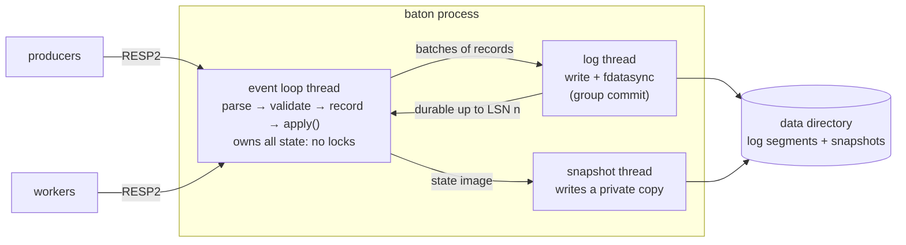

# baton

[](https://github.com/GaganGutta/baton/actions/workflows/ci.yml)

**baton is a durable job queue in a single binary.** Your app enqueues work,
workers reserve it under a lease, and no job the server has acknowledged is ever
lost — not if the server is killed mid-write, not if a worker dies mid-job, not
if the power goes. It needs no Postgres, no Redis and no broker: one process,
one data directory. Clients speak the Redis wire protocol with baton's own
commands, so every language that has a Redis client already has a baton client,
and there is a Python SDK with a worker that handles leases, heartbeats, retries
and graceful shutdown for you. It is written from scratch in C++20, in the
spirit of Beanstalkd and Faktory, and every guarantee below is tied to a test
that fails when the guarantee is broken.

## Quickstart

The server, built from source into a container:

```bash
docker build -t baton https://github.com/GaganGutta/baton.git
docker run -d --name baton -p 127.0.0.1:7379:7379 -v baton-data:/var/lib/baton baton
```

A worker and a producer in Python ([`examples/quickstart`](examples/quickstart)):

```bash
pip install "git+https://github.com/GaganGutta/baton#subdirectory=sdk/python"
```

```python
# worker.py
import baton

worker = baton.Worker(["emails"], concurrency=4)

@worker.task()
def send_welcome(address):
    print("sending a welcome email to", address)

worker.run()          # until SIGTERM / Ctrl-C; running jobs are allowed to finish
```

```python
# enqueue.py
import baton

client = baton.Client()
job_id = client.enqueue_task("emails", "send_welcome", ["ada@example.com"], key="welcome-ada")
print("enqueued", job_id)   # when this prints, the job is on disk
```

Run `python worker.py` in one terminal and `python enqueue.py` in another. Then
be unkind: `docker kill baton && docker start baton` between the two, or kill
the worker mid-job. Enqueued jobs are still there; a job whose worker died comes
back when its lease expires; `key=` makes the producer safe to run twice.

Any Redis client works too:

```bash
redis-cli -p 7379 ENQUEUE emails '{"task":"send_welcome","args":["grace@example.com"],"kwargs":{}}'
redis-cli -p 7379 STATS emails
```

## What baton guarantees

[`docs/guarantees.md`](docs/guarantees.md) lists every promise with the test that
checks it; the README claims nothing that file does not. In short:

- **No acknowledged job is lost.** No reply that confirms or reveals a state
  change is sent before every log record it depends on has been `fdatasync`ed.
  Proven against a simulated file system that loses, keeps or tears un-synced
  data at every file-system operation, and against `kill -9` of the real binary.
- **At-least-once delivery with fencing.** A job has at most one valid lease;
  lease tokens only grow; a worker whose lease expired can change nothing, even
  if it wakes up later. Checked by an independent model that replays the
  server's own log after every chaos round.
- **Corruption is refused, not papered over.** A torn final write is repaired; a
  flipped bit anywhere else makes baton refuse to start rather than silently drop
  what came after it.
- **Retries, backoff, a dead-letter queue, delays, priorities, idempotency
  keys** — one key never creates two jobs, even across retries and restarts.
- **Snapshots and log compaction** that never stop the server and never weaken
  the above, including a crash at any point of a snapshot.
- **The tests can fail.** A mutation check breaks 29 rules one at a time and
  requires the suite to notice; the chaos harness is run against servers with
  planted bugs and must catch them.

What it does **not** promise: exactly-once *effects*. A handler can run twice
(the worker dies after the side effect, before the acknowledgement). The SDK's
`Ledger` makes an effect exactly-once when the effect can be a ledger entry, and
is honest about the window that remains when it cannot
([design, 9.4](docs/design.md)).

## How it works



Three rules carry the design ([`docs/design.md`](docs/design.md) has the
reasoning, decision by decision):

1. **One owner.** A single thread owns every job, queue, timer and connection,
   so there is nothing to lock and no ordering between threads to get wrong.
2. **Reply after durable.** Records get increasing sequence numbers and become
   durable in order, so "everything this reply depends on" is one number. Replies
   wait in a per-connection queue until the log thread reports that number
   durable. Many connections share each `fdatasync` (group commit), so waiting
   for the disk costs latency, not throughput.
3. **One `apply`.** Handlers never mutate state. They resolve every source of
   nondeterminism — ids, timestamps, backoff jitter, lease tokens — into a log
   record and hand it to `apply()`; recovery hands the records on disk to the
   same function. There is no second code path that could drift.

## Commands

The full reference is [`docs/protocol.md`](docs/protocol.md).

| Command | |
|---|---|
| `ENQUEUE queue payload [PRIORITY n] [DELAY ms \| AT unix_ms] [MAXATTEMPTS n] [BACKOFF base cap] [KEY k]` | add a job; returns its id once it is on disk |
| `RESERVE timeout_ms lease_ms queue [queue ...]` | lease the next job, waiting up to `timeout_ms`; returns id, lease token, payload, attempt |
| `HEARTBEAT id token [lease_ms]` | extend the lease; `STALE` means the job is no longer yours |
| `ACK id token` | done; safe to repeat if the reply was lost |
| `FAIL id token [error [RETRYIN ms \| NORETRY]]` | retry with backoff, or dead-letter |
| `CANCEL id` · `STATUS id [PAYLOAD]` · `STATS [queue]` | |
| `DLQ.LIST queue` · `DLQ.RETRY id \| queue ALL` · `DLQ.PURGE id \| queue ALL` | the dead-letter queue |
| `SNAPSHOT` · `INFO [section]` · `AUTH` · `PING` · `HELLO` | operations; stock client handshakes work |

## Performance

Measured with `bench/run_all.sh` and `bench/compare/run_compare.sh` on a laptop
(AMD Ryzen 9 8945HS, 16 threads, WSL2, ext4 on a virtual disk whose `fdatasync`
takes about 2 ms), commit `4f45de4`, 256-byte payloads. Every row, the full
tables, and what the numbers cannot tell are in
[`docs/benchmarks.md`](docs/benchmarks.md).

**Enqueue, every job fsynced before its reply (`--fsync always`).** Group commit
lets waiting clients share each `fdatasync`:

| connections | jobs/s | latency p50 / p99 ms | records per fsync |
|---:|---:|---:|---:|
| 1 | 451 | 2.16 / 3.93 | 1.0 |
| 64 | 14,393 | 4.46 / 8.26 | 32.0 |
| 256 | 30,305 | 8.39 / 10.49 | 126.7 |
| 8, pipelined 32 deep | 59,260 | 4.19 / 8.00 | 128.0 |

Without waiting for the disk (`--fsync interval`), 8 pipelining connections
reach 303,879 jobs/s on the single event-loop thread.

**Next to Beanstalkd 1.13 and Faktory 1.10**, same machine, same load
generator, each in a container:

| what an acknowledgement means | system | enqueue, 1 connection | enqueue, 64 connections | completed end to end (8 producers, 32 workers) |
|---|---|---:|---:|---:|
| fsynced | baton `--fsync always` | 470 | **14,148** | **1,772** |
| fsynced | Beanstalkd `-f 0` | **754** | 743 | 367 |
| fsync every 50 ms | baton `--fsync interval` | 6,296 | **28,695** | **9,452** |
| fsync every 50 ms | Beanstalkd `-f 50` | **10,028** | 19,505 | 7,454 |
| RDB snapshots, no fsync per job | Faktory (defaults) | 5,364 | 78,165 | 11,971 |

Jobs per second; bold marks the faster of baton and Beanstalkd within a group. Beanstalkd is faster with a single client: baton hands every
record to a log thread and back. baton is faster once clients share the disk.
Faktory is fastest under load and makes the weakest promise: its snapshot
schedule can lose up to 30 seconds of acknowledged jobs.

Other measurements: a queued job costs about 290 bytes plus its payload, and
restarting after `kill -9` with 1.24 million queued jobs takes 0.82 s from the
log alone and 0.71 s from a snapshot.

## How it compares

| | baton | Beanstalkd | Faktory | Temporal | River |
|---|---|---|---|---|---|
| Runs as | one binary | one binary | one binary (embeds Redis) | several services + a database | a library on your Postgres |
| A job acknowledged to the producer survives a power cut | yes (`--fsync always`, the default) | with `-b` and `-f 0` | no: snapshots every 30 s at best | yes | yes (it is a Postgres transaction) |
| Enqueue in the same transaction as your data | no | no | no | no | **yes** |
| Fencing tokens for zombie workers | yes | no | no | n/a (workflow tasks) | no |
| Idempotent enqueue | keys, 24 h window | no | unique jobs (Enterprise) | workflow ids | unique jobs |
| Multi-step workflows | not yet (planned for v0.2: steps, sleep, signals) | no | batches (Enterprise) | **the real thing**: versioning, child workflows, queries | no |
| Replication / high availability | **no** | no | no (Redis replica possible) | yes | what Postgres gives you |
| Web UI | not yet (planned for v0.2) | third-party | yes | yes | yes |
| Years in production | **none** | 15+ | 8+ | 6+ (and Cadence before) | a few |

Honestly:

- **Beanstalkd** is the closest relative and the better choice if you want
  something tiny that has run in production since 2007. baton adds what I missed
  in it: replies that wait for the disk *with* group commit (Beanstalkd's `-f 0`
  pays one `fsync` per job), lease tokens, idempotency keys, server-side retry
  backoff and a dead-letter queue with reasons, snapshots instead of an
  ever-growing binlog, and the Redis protocol instead of its own.
- **Faktory** has far more features (web UI, middleware ecosystem, batches and
  cron in the commercial editions) and client libraries in many languages. Its
  storage is Redis with RDB snapshots, so a crash can lose the last seconds of
  acknowledged jobs; for many workloads that is fine, and then Faktory is the
  more complete product.
- **Temporal** is a workflow platform; baton is a job queue whose planned
  workflows (v0.2) are a small subset of Temporal's ideas in one process. If you
  need its scale, multi-language SDKs, versioning or visibility, nothing here
  competes — and you will operate a database and several services for it.
- **River** (like Oban, GoodJob and other Postgres-backed queues) can enqueue a
  job *in the same transaction* as the business data it belongs to. No external
  queue can do that, baton included. If you already run Postgres and that matters
  to you, use one of them.

## When not to use baton

- You need **high availability**. baton is a single node: if the machine is
  down, the queue is down; if the disk dies, the data is gone unless you backed
  up the data directory.
- Your backlog does not **fit in RAM** (every live job is held in memory).
- You need **transactional enqueue** with your database (see River above).
- You need **exactly-once effects** and cannot make handlers idempotent.
- The network between clients and server is **untrusted**: there is no TLS and
  one shared password. Put it behind a private network or a TLS tunnel.
- You want something **battle-tested**. baton is a new project with a serious
  test suite, not years of production use.

## Building and testing

Linux (primary) or macOS, a C++20 compiler (GCC 13+, Clang 16+), CMake 3.24+
and Ninja:

```bash
cmake --preset release && cmake --build --preset release
ctest --preset release
./build/release/src/server/baton --help
```

| | |
|---|---|
| `scripts/check.sh` | what CI runs: formatting, ASan+UBSan, TSan, clang-tidy |
| `scripts/mutation-check.sh` | breaks one rule at a time; every mutant must be killed |
| `scripts/fuzz.sh 60` | seven libFuzzer targets |
| `chaos/run.py --seeds 1-3 --faults` | kill rounds and fault injection ([`docs/testing.md`](docs/testing.md)) |
| `bench/run_all.sh` | every number in this README |

## Documentation

- [`docs/design.md`](docs/design.md) — how baton works and why, decision by decision, with limitations
- [`docs/guarantees.md`](docs/guarantees.md) — exactly what is promised, each promise tied to a test
- [`docs/protocol.md`](docs/protocol.md) — the wire protocol and command reference
- [`docs/testing.md`](docs/testing.md) — test layers, mutation check, fuzzing, the chaos harness and its results
- [`docs/benchmarks.md`](docs/benchmarks.md) — every measurement with machine, commit and command
- [`docs/roadmap.md`](docs/roadmap.md) — what is deliberately not built (yet)
- [`sdk/python`](sdk/python) — the Python SDK
- [`PLAN.md`](PLAN.md), [`PROGRESS.md`](PROGRESS.md) — how the project was built, milestone by milestone

## License

[MIT](LICENSE)
